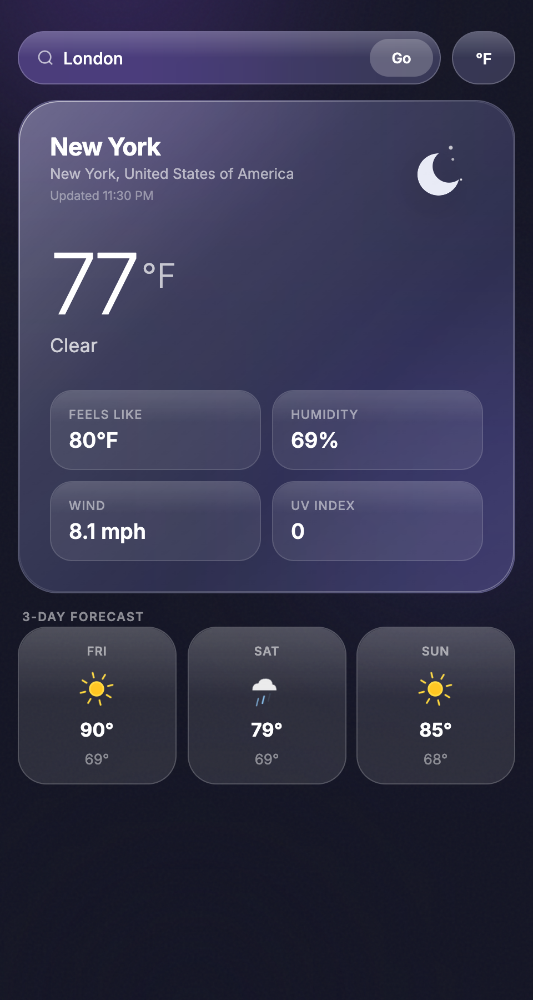
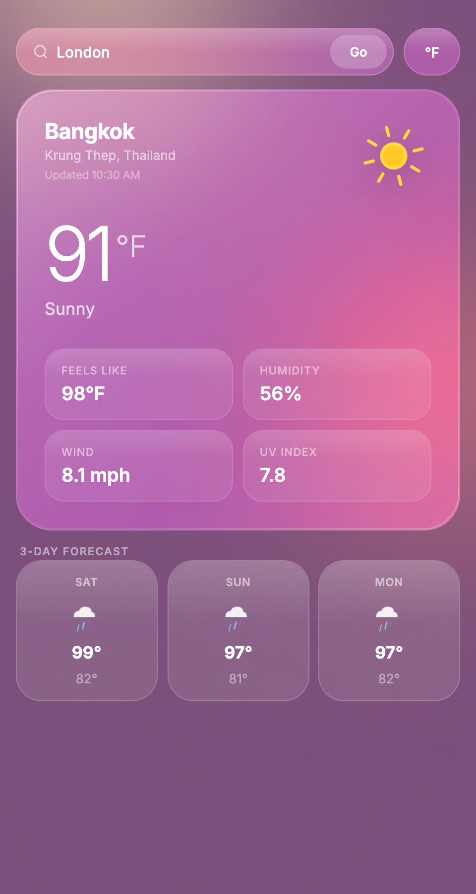
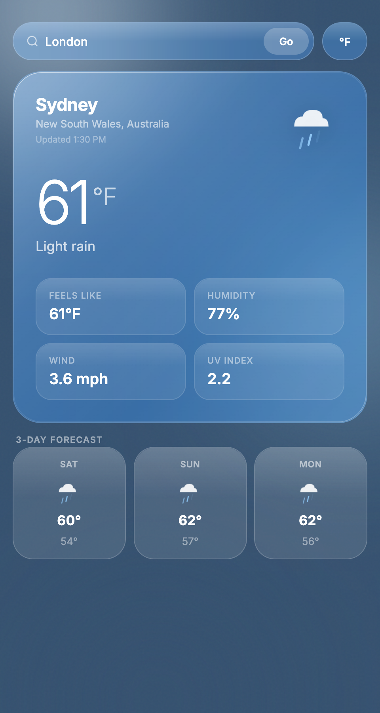

# Weather App

A clean, responsive weather application with dynamic backgrounds that change based on current weather conditions and time of day. Built with vanilla JavaScript, an Express backend, and the WeatherAPI.

## Features

- **Auto-location detection** — Detects your location on load and shows local weather immediately
- **Smart unit defaults** — Automatically picks °F for US users, °C everywhere else
- **Dynamic backgrounds** — Gradient shifts based on weather condition (sunny, rainy, snowy, stormy, etc.)
- **Night mode** — Automatically switches to dark indigo theme when it's nighttime at the searched location
- **Temperature toggle** — Switch between Celsius and Fahrenheit anytime; wind speed converts too
- **Glassmorphism UI** — Frosted glass cards with Inter font and smooth fade-up animations
- **Detail chips** — Feels Like, Humidity, Wind, and UV Index at a glance
- **3-Day Forecast** — Upcoming days with weather icons, highs and lows
- **Accurate timestamps** — Last-updated time shown in the location's local time zone

## Screenshots


*Clear night — animated crescent moon, deep indigo liquid glass*


*Sunny and hot — spinning sun icon, warm pink-purple gradient*


*Light rain — animated rain cloud, cool blue gradient*

## Tech Stack

- **Frontend**: HTML5, CSS3, Vanilla JavaScript (Inter font via Google Fonts)
- **Backend**: Node.js, Express.js
- **API**: [WeatherAPI.com](https://www.weatherapi.com/)
- **Dependencies**: Axios, dotenv

## Prerequisites

- Node.js v14+
- A free API key from [WeatherAPI.com](https://www.weatherapi.com/)

## Installation

1. Clone the repo:
   ```bash
   git clone https://github.com/illfindyouagain/weather-app.git
   cd weather-app
   ```

2. Install dependencies:
   ```bash
   npm install
   ```

3. Create a `.env` file in the root directory:
   ```env
   WEATHER_API_KEY=your_api_key_here
   ```

4. Start the server:
   ```bash
   npm start
   ```

5. Open [http://localhost:8000](http://localhost:8000) in your browser.

### Development (auto-restart)
```bash
npm run dev
```

## Weather Color Palettes

| Condition | Gradient |
|-----------|----------|
| **Clear/Sunny** | Warm sunset tones (#FFE1B3 → #F98475 → #7B4E7A) |
| **Cloudy** | Cool pastel grays (#DCE2E9 → #A9B1C1 → #5A6073) |
| **Rainy/Drizzle** | Soft blue tones (#C8D9E6 → #7FA5C0 → #35516F) |
| **Storm/Thunder** | Dark dramatic violets (#B7A9C9 → #6A5A87 → #1E2333) |
| **Snowy** | Cool whites & blues (#F5F9FC → #C5D5E4 → #6D86A0) |
| **Night** | Deep atmospheric indigos (#49307A → #2B2557 → #131424) |

## Project Structure

```
weather-app/
├── public/
│   ├── index.html       # App shell
│   ├── styles.css       # Glassmorphism UI + animations
│   └── app.js           # Client-side logic
├── screenshots/         # README screenshots
├── server.js            # Express backend (API proxy)
├── .env                 # API key (not in Git)
├── package.json
└── README.md
```

## Security

- API key lives server-side in `.env` — never exposed to the client
- All WeatherAPI requests proxied through Express with input validation
- No secrets in frontend code

## Deployment

**Backend** — Deploy `server.js` to [Render](https://render.com), [Railway](https://railway.app), or [Fly.io](https://fly.io). Set `WEATHER_API_KEY` in the platform's environment settings.

**Frontend** — The `public/` folder is served statically by the same Express server, so no separate frontend deployment is needed.

---

Made with ❤️ by [illfindyouagain](https://github.com/illfindyouagain)
